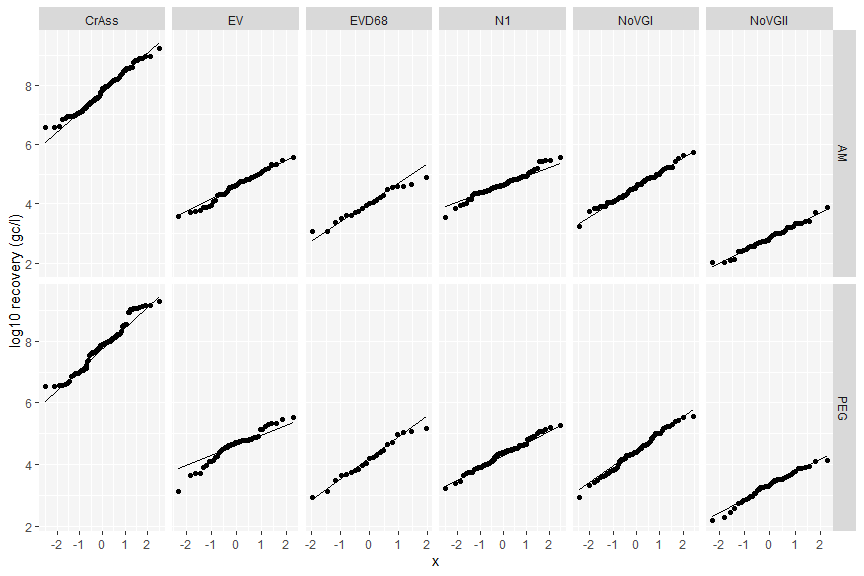
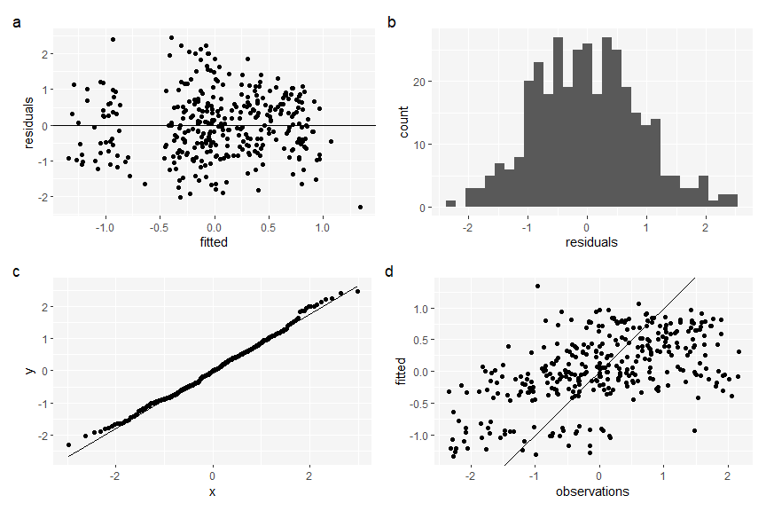

Comparative assessment of filtration- and precipitation-based methods
for the concentration of SARS-CoV-2 and other viruses from wastewater
================
Cameron Pellett
17/03/2022

This document and github repo provides the r code for results (3.2)
produced in *Comparative assessment of filtration- and
precipitation-based methods for the concentration of SARS-CoV-2 and
other viruses from wastewater*. The full report with code is included
below. The source code for this document can be found in README.rmd. For
a cleaner report with a html output, Chem-Con-Bangor-Bath.rmd can be
used. qPCR recovery data can be found in Barbara_full_dataset.csv and
some additional untidy notes and exploration can be found in notes.r.
Results in section 3.1. can be found in another repo:
<https://github.com/CameronPellett/Spiked-virus-concentration-Bangor>.
Text may have been changed for final publication.

``` r
library(tidyverse)
library(lme4)
library(ggrepel)
library(ggbeeswarm)
library(patchwork)
library(broom)

theme_set(theme_grey()+theme(panel.background = element_rect(fill = "grey96")))
```

``` r
pvalue_fun <- function(p.value){
  if(is.na(p.value)){
    NA_character_
  }else if(p.value > 0.05){
    "> 0.05"
  }else if(p.value < 0.05 & p.value > 0.01){
    "< 0.05"
  }else if(p.value < 0.01 & p.value > 0.001){
    "< 0.01"
  }else if(p.value < 0.001){
    "< 0.001"
  }else {
    "something went wrong"
  }
}

pvalue_star <- function(p.value){
  if(is.na(p.value)){
    NA_character_
  }else if(p.value > 0.05){
    "."
  }else if(p.value < 0.05 & p.value > 0.01){
    "*"
  }else if(p.value < 0.01 & p.value > 0.001){
    "**"
  }else if(p.value < 0.001){
    "***"
  }else {
    "something went wrong"
  }
}

stat_paste_fun <- function(stat, log = FALSE){
  if(log != TRUE){
    paste0(str_remove_all(stat[["method"]][[1]], "\n\t"), ": ", 
           str_remove_all(names(stat[["statistic"]]), "Kruskal-Wallis "), " = ",
           round(stat[["statistic"]][[1]],1), ", ",
           if(length(stat[["parameter"]]) == 0)
           {""
           }else if(is.na(stat[["parameter"]])){
             ""
           }else if(length(stat[["parameter"]]) > 0){
             paste0("df = ", round(stat[["parameter"]], 0), ", ")
           } ,
           "p-value ",  pvalue_fun(stat[["p.value"]]))
  }else{
    paste0(str_remove_all(stat[["method"]][[1]], "\n\t"), " (log y): ", 
           str_remove_all(names(stat[["statistic"]]), "Kruskal-Wallis "), " = ",
           round(stat[["statistic"]][[1]],1), ", ",
           if(length(stat[["parameter"]]) == 0)
           {""
           }else if(is.na(stat[["parameter"]])){
             ""
           }else if(length(stat[["parameter"]]) > 0){
             paste0("df = ", round(stat[["parameter"]], 0), ", ")
           } ,
           "p-value ",  pvalue_fun(stat[["p.value"]]))
  }
}

plot_assumptions <- function(model, obs, bins = 30){
        #create tibble for use in ggplot of model assumptions
        df <- tibble(
                observations = obs,
                fitted = fitted(model),
                residuals = resid(model),
                standardised_residuals = sqrt(resid(model)^2),
                RMSresiduals = sqrt(mean(resid(model)^2)))
    
        
        a <- ggplot(df, aes(fitted, residuals))+
                geom_point()+
                geom_abline(aes(slope = 0, intercept = 0))
                #labs(title = "Heteroscedasticity", subtitle = "Check trends not captured by model")
        
        b <- ggplot(df, aes(residuals))+
                geom_histogram(bins = bins)
        
        c <- ggplot(df, aes(sample = residuals))+
                geom_qq()+
                geom_qq_line()#+
                #labs(title = "Quantile-quantile plot", subtitle = "check normality of residuals")
        
        d <- ggplot(df, aes(observations, fitted))+
                geom_point()+
                geom_abline()#+
                #labs(subtitle = "Check accuracy of model across whole dataset")
        
        return( (a + b) / (c + d) + plot_annotation(tag_levels = "a"))
} 
```

``` r
data <- read_csv("Barbara_full_dataset_Bangor.csv")

flow <- read_csv("flow.csv") 
```

``` r
long <- data|>
  select(-contains("RSV"), -contains("phi6"))|>
  group_by(sample_site_name, timestamp_sample_collected, timestamp_sample_received)|>
  mutate(biorep = row_number())|>
  pivot_longer(cols = contains("_gc_l"), names_to = "con_vir", values_to = "gc_l")|>
  separate(con_vir, into = c("method", "virus"), sep = "_", extra = "drop")|>
  filter(method != "SN")

long_sc <- long|>
  ungroup()|>
  mutate(gc_l_log = log10(gc_l),
         sample_ph_pre_ansis = scale(sample_ph_pre_ansis)[,1], 
         conductivity_ms_cm = scale(conductivity_ms_cm)[,1],
         ammonia_mg_l = scale(ammonia_mg_l)[,1],
         ophosph_mg_l = scale(ophosph_mg_l)[,1],
         Turbidity = scale(Turbidity)[,1])
  
diff <- long_sc|>
  select(-gc_l_log)|>
  pivot_wider(names_from = "method", values_from = "gc_l")|>
  group_by(virus)|>
  mutate(
      PEG_divby_AM = PEG / AM,
        AM_divby_PEG = AM / PEG)|>
  filter(PEG != 0, AM != 0,
         PEG_divby_AM < 10 & AM_divby_PEG < 10)
```

<br>

### Statistical methodology

Statistical tests were carried out in R (R Core Team, 2020); the full
script and data are provided in a dedicated repository
(<https://github.com/CameronPellett/Chem-Con-Bangor-Bath>).

Viral recovery with the amicon and BE-PEG methods was compared for six
viruses (crAssphage, enterovirus, enterovirus D68, SARS-CoV-2, NoVGI,
and NoVGII). The recovery in gene copies per litre was log<sub>10</sub>
transformed to meet assumptions for parametric analysis, then
statistical comparisons were made using paired t-tests. Residual qq
plots can be found in supplementary figure S1.

Concentrations of ammonium, conductivity and orthophosphate have been
shown to correlate with human populations, and thus relate to flow over
short periods of time flow (REF). Therefore, the variability in flow had
to be removed to assess the comparative effect of water chemistry
variables, including ammonium, conductivity and orthophosphate, on each
concentration method. To remove this variability, the gene copies per
litre recovered by the amicon method was divided by the gene copies per
litre recovered by the BE-PEG method. As each sample was paired, both
sample methods were influenced by the same variability in flow, which
was removed through this division. A linear mixed effects model was then
used to assess the comparative effect of wastewater chemistry and
quality variables (turbidity, pH, orthophosphate, conductivity, and
ammonium) on the proportion of each concentration methods viral
recovery, utilising random effects for the target virus to borrow
strength in a combined assessment of all viruses (eq. 2). Prior to the
model being fit, the dependent variable was power transformed using the
Box-Cox method (eq. 1; eq. 2; Box and Cox, 1964), with lambda (*λ*)
selected by maximising the log-Likelihood of a multiple linear
regression with all predictors used in the final linear mixed effects
model. The residual plots of the final model can be found in
supplementary figure S2.

$$  
y(\\lambda) = \\{\\frac{y ^ \\lambda -1}{\\lambda}, \\quad if \\space \\lambda \\neq 0;\\quad log \\space y, \\quad if \\space \\lambda = 0 \\rbrace  \\tag{eq. 1}
$$

Where: *y* is the variable to be power transformed; and *λ* is selected
through maximising the log-Likelihood of a multiple linear regression
with all predictors used in the final linear mixed effects model (eq .
2).

<br>

$$
y(\\lambda)\_{ij} = \\beta\_{0} + \\beta\_{1} \\space turbidity\_{ij} + \\beta\_{2} \\space pH\_{i} + \\beta\_{3} \\space orthophosphate\_{ij} + \\\\ \\quad \\quad \\quad  \\beta\_{4} \\space conductivity\_{ij} + \\beta\_{5} \\space ammonium\_{ij} + \\gamma\_{j} \\space virus\_{ij} + \\epsilon  \\tag{eq. 2}
$$

Where: *y*(*λ*)<sub>*i**j*</sub> is *i*th value of *N* total
observations in the response variable after power transformation. *j*
relates to group of *F* groups equal to the number of levels in the
target virus variable; *β*<sub>0</sub> is the intercept, and
*β*<sub>1</sub>, ..., *β*<sub>5</sub> are the fixed-effects coefficient
estimates; *γ*<sub>*j*</sub> is the random-effects coefficients in group
*j*; and *ϵ* is the error between the model prediction and observation
*i* in group *j*.

<br>

## 3. Results

``` r
meth_comp_data <- semi_join(long_sc, diff,
                            by = c("sample_site_name",
                                   "timestamp_sample_collected",
                                   "timestamp_sample_received", "biorep", "virus"))

qq_meth_comp <- meth_comp_data|>
  group_by(virus)|>
  mutate(row = row_number())|>
  ggplot(aes(sample = log10(gc_l)))+
  geom_qq()+
  geom_qq_line()+
  facet_grid(method ~ virus, scales = "free")

viruses_t.test <- meth_comp_data|>
  group_by(virus)|>
  summarise(max = max(gc_l, na.rm = T),
            min = min(gc_l, na.rm = T),
            mean = mean(gc_l, na.rm = T))|>
  bind_cols(stat = NA_character_,
            row = 1)

for (i in 1:nrow(viruses_t.test )) {
  filt_virus <- viruses_t.test [i,1][[1]]
  
  viruses_t.test [i,5] <- stat_paste_fun(t.test(gc_l_log ~ method, data = filter(meth_comp_data, virus == filt_virus), paired =TRUE), log = TRUE)
  
  
}

method_comp_plot <- meth_comp_data|>
  group_by(virus)|>
  mutate(row = row_number())|>
  left_join(viruses_t.test, by = c("virus", "row"))|>
  mutate(method = str_replace_all(method, c("PEG" = "BE-PEG")),
         virus = str_replace_all(virus, c("N1" = "SARS",
                                          "CrAss" = "crAss")))|>
  ggplot(aes(method, gc_l))+
  geom_boxplot(outlier.shape = NA)+
  geom_beeswarm(cex = 1.5, size = 1.5, alpha = 0.8)+
  geom_beeswarm(cex = 1.5, colour = "white", shape = ".")+
  geom_text(aes(label = stat, x = 1.5, y = max + (0.07 * (max - min))), size = 2.5)+
  facet_wrap(~virus, scale = "free")
```

### 3.1 Amicon and BE-PEG concentration methods have varied recovery depending on the target virus

The BE-PEG and amicon methods had varying performance depending on the
target virus (Figure 1). Median gene copies per litre were similar
between methods when targeting crAssphage ( AM:
`` `r meth_comp_data|>filter(virus == "CrAss", method == "AM")|>pull(gc_l)|>median()|>format(digits = 2, scientific = TRUE)` ``
7e+07 gc/l; BE-PEG:
`` `r meth_comp_data|>filter(virus == "CrAss", method == "PEG")|>pull(gc_l)|>median()|>format(digits = 2, scientific = TRUE)` ``
7.7e+07 gc/l ), enterovirus ( AM:
`` `r meth_comp_data|>filter(virus == "EV", method == "AM")|>pull(gc_l)|>median()|>format(digits = 2, scientific = TRUE)` ``
4.2e+04 gc/l; BE-PEG:
`` `r meth_comp_data|>filter(virus == "EV", method == "PEG")|>pull(gc_l)|>median()|>format(digits = 2, scientific = TRUE)` ``
5.2e+04 gc/l ) and enterovirus D68 ( AM:
`` `r meth_comp_data|>filter(virus == "EVD68", method == "AM")|>pull(gc_l)|>median()|>format(digits = 2, scientific = TRUE)` ``
1e+04 gc/l; BE-PEG:
`` `r meth_comp_data|>filter(virus == "EVD68", method == "PEG")|>pull(gc_l)|>median()|>format(digits = 2, scientific = TRUE)` ``
1.6e+04 gc/l ), and mean log<sub>10</sub> transformed recoveries were
not found to differ significantly between methods (paired t-test;
p-value \> 0.05). Conversely, the amicon method recovered greater median
gene copies per litre when targeting SARS-CoV-2 ( AM:
`` `r meth_comp_data|>filter(virus == "N1", method == "AM")|>pull(gc_l)|>median()|>format(digits = 2, scientific = TRUE)` ``
4.2e+04 gc/l; BE-PEG:
`` `r meth_comp_data|>filter(virus == "N1", method == "PEG")|>pull(gc_l)|>median()|>format(digits = 2, scientific = TRUE)` ``
2.4e+04 gc/l ) and norovirus GI ( AM:
`` `r meth_comp_data|>filter(virus == "NoVGI", method == "AM")|>pull(gc_l)|>median()|>format(digits = 2, scientific = TRUE)` ``
3.9e+04 gc/l; BE-PEG:
`` `r meth_comp_data|>filter(virus == "NoVGI", method == "PEG")|>pull(gc_l)|>median()|>format(digits = 2, scientific = TRUE)` ``
2.4e+04 gc/l ), whilst the BE-PEG method recovered a greater median gene
copies per litre when targeting norovirus GII compared to the amicon
method ( AM:
`` `r meth_comp_data|>filter(virus == "NoVGII", method == "AM")|>pull(gc_l)|>median()|>format(digits = 2, scientific = TRUE)` ``
7e+02 gc/l; BE-PEG:
`` `r meth_comp_data|>filter(virus == "NoVGII", method == "PEG")|>pull(gc_l)|>median()|>format(digits = 2, scientific = TRUE)` ``
2.1e+03 gc/l ). Differences that were found to be significant when
comparing mean log<sub>10</sub> transformed gene copies per litre
(paired t-test; p-value \< 0.001). These conflicting results suggest
neither method is consistently better than the other. Although, the
amicon method may be best for projects which plan to primarily target
SARS-CoV-2, particularly in catchments where low concentrations of virus
in wastewater are frequent.

<br>

``` r
method_comp_plot+
  labs(y = "Gene copies per litre",
       x = "Method")
```

<!-- -->

Figure 1: Comparison of viral recovery for amicon (AM) and beef extract
polyethene glycol (BE-PEG) concentration methods. Statistical
comparisons were made using paired t-tests after log transformation of
the gene copies per litre. Recovery of crAssphage (crAss), enterovirus
(EV), and enterovirus D68 (EVD68) could not be assumed to have differing
means; whilst SARS-CoV-2 (SARS) and norovirus GI (NoVGI) had
significantly greater mean recovery with the amicon method, and
norovirus GII (NoVGII) had significantly greater mean recovery with the
BE-PEG method.

<br>

### 3.2 The amicon method performes comparitively better than BE-PEG as concentrations of ammonium increase

A linear mixed effects model (lmm) was selected to assess the
comparative effect of chemistry on viral recovery using both BE-PEG and
amicon concentration methods. To remove the variability of other
factors, including flow, the dependent variable was calculated as the
proportion of viral recovery with the amicon method compared to the
BE-PEG method (amicon recovery divided by BE-PEG recovery). The assessed
proportion was then power transformed using the Box-Cox method to meet
assumptions of a linear regression, selecting the lambda that maximised
the log-Likelihood of a multiple linear model using all predictors used
in the final lmm ( lambda = `` `r round(boxcoxlambda2, 2)` `` -0.02 ).
The lmm found ammonium had a significant positive effect (p-value \<
0.01), suggesting the amicon method performs better when there are
greater concentrations of inhibitors. However, none of the other
chemistry variables had significantly different effects on the amicon
and BE-PEG methods (p-value \> 0.05), and the intercept was not
significant suggesting the methods did not have different mean
recoveries when assessing all viruses. These results suggest the amicon
method may be preferable when catchments have high concentrations of
ammonium, including those with high levels of agricultural runoff in the
sewage network.

<br>

``` r
lmm_plot+
  theme(axis.title.y = element_blank())
```

<!-- -->

Figure 2: Linear mixed model assessing the effect of chemistry on the
proportion of amicon BE-PEG gene copies per litre recovery (amicon
recovery divided by BE-PEG recovery). The assessed proportion was power
transformed using the Box-Cox method, selecting the lambda that
maximised the log-Likelihood ( lambda =
`` `r round(boxcoxlambda2, 2)` `` -0.02 ). The target virus was included
as random effects to account for the variability between viruses,
borrowing strength to assess the effect of chemistry. Estimates less
than zero suggest the amicon method performs worse than the BE-PEG
method when predictor variables increase, or on average with regards to
the intercept. Estimates are labeled with their p-values and the line
ranges around the estimate indicate the 95% confidence intervals (CI).

<br>

## References

Box, G.E. and Cox, D.R., 1964. An analysis of transformations. Journal
of the Royal Statistical Society: Series B (Methodological), 26(2),
pp.211-243.

<br>

## Supplementary

<br>

``` r
qq_meth_comp+
  ylab("log10 recovery (gc/l)")
```

<!-- -->

Figure S1:quantile-quantile normality of the log10 transformed recovery
of each virus with each concentration method.

<br>

``` r
lmm_residual_plot
```

<!-- -->

Figure S2: Residual plot of the linear mixed effects model. Residual
plots of (a) homoscedasticity, (b) histogram normality, (c)
quantile-quantile normality with x as a theoretical normal distribution,
and (d) true observations against fitted values.
